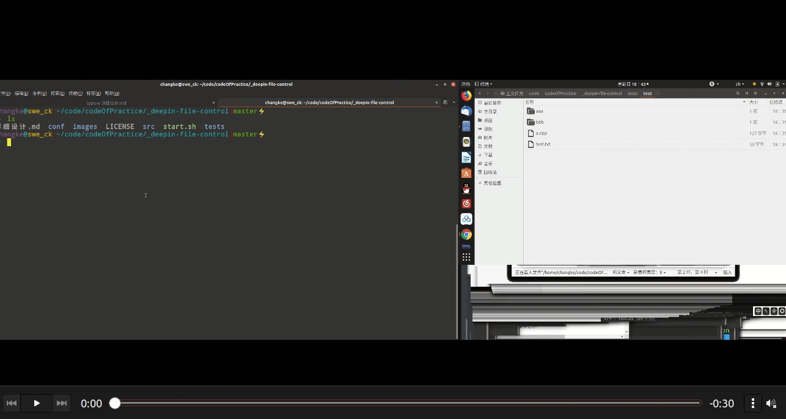

### 【管控客户端第第2版】

          <h2>
<a id="user-content-项目概况" class="anchor" href="#%E9%A1%B9%E7%9B%AE%E6%A6%82%E5%86%B5" aria-hidden="true"><svg class="octicon octicon-link" viewBox="0 0 16 16" version="1.1" width="16" height="16" aria-hidden="true"><path fill-rule="evenodd" d="M4 9h1v1H4c-1.5 0-3-1.69-3-3.5S2.55 3 4 3h4c1.45 0 3 1.69 3 3.5 0 1.41-.91 2.72-2 3.25V8.59c.58-.45 1-1.27 1-2.09C10 5.22 8.98 4 8 4H4c-.98 0-2 1.22-2 2.5S3 9 4 9zm9-3h-1v1h1c1 0 2 1.22 2 2.5S13.98 12 13 12H9c-.98 0-2-1.22-2-2.5 0-.83.42-1.64 1-2.09V6.25c-1.09.53-2 1.84-2 3.25C6 11.31 7.55 13 9 13h4c1.45 0 3-1.69 3-3.5S14.5 6 13 6z"></path></svg></a>项目概况</h2>
<h3>
<a id="user-content-背景" class="anchor" href="#%E8%83%8C%E6%99%AF" aria-hidden="true"><svg class="octicon octicon-link" viewBox="0 0 16 16" version="1.1" width="16" height="16" aria-hidden="true"><path fill-rule="evenodd" d="M4 9h1v1H4c-1.5 0-3-1.69-3-3.5S2.55 3 4 3h4c1.45 0 3 1.69 3 3.5 0 1.41-.91 2.72-2 3.25V8.59c.58-.45 1-1.27 1-2.09C10 5.22 8.98 4 8 4H4c-.98 0-2 1.22-2 2.5S3 9 4 9zm9-3h-1v1h1c1 0 2 1.22 2 2.5S13.98 12 13 12H9c-.98 0-2-1.22-2-2.5 0-.83.42-1.64 1-2.09V6.25c-1.09.53-2 1.84-2 3.25C6 11.31 7.55 13 9 13h4c1.45 0 3-1.69 3-3.5S14.5 6 13 6z"></path></svg></a>背景</h3>
<ul>
<li>项目来源：<a href="https://www.deepin.org/devcon-2019/topic" rel="nofollow">2019 深度软件开发大赛</a>
</li>
<li>项目名称：文件管控客户端</li>
</ul>
<h3>
<a id="user-content-运行环境" class="anchor" href="#%E8%BF%90%E8%A1%8C%E7%8E%AF%E5%A2%83" aria-hidden="true"><svg class="octicon octicon-link" viewBox="0 0 16 16" version="1.1" width="16" height="16" aria-hidden="true"><path fill-rule="evenodd" d="M4 9h1v1H4c-1.5 0-3-1.69-3-3.5S2.55 3 4 3h4c1.45 0 3 1.69 3 3.5 0 1.41-.91 2.72-2 3.25V8.59c.58-.45 1-1.27 1-2.09C10 5.22 8.98 4 8 4H4c-.98 0-2 1.22-2 2.5S3 9 4 9zm9-3h-1v1h1c1 0 2 1.22 2 2.5S13.98 12 13 12H9c-.98 0-2-1.22-2-2.5 0-.83.42-1.64 1-2.09V6.25c-1.09.53-2 1.84-2 3.25C6 11.31 7.55 13 9 13h4c1.45 0 3-1.69 3-3.5S14.5 6 13 6z"></path></svg></a>运行环境</h3>
<ul>
<li>deepin Linux x86_64 系统，理论上也兼容其他 x86_64 Linux 系统</li>
</ul>
<h3>
<a id="user-content-条件与限制" class="anchor" href="#%E6%9D%A1%E4%BB%B6%E4%B8%8E%E9%99%90%E5%88%B6" aria-hidden="true"><svg class="octicon octicon-link" viewBox="0 0 16 16" version="1.1" width="16" height="16" aria-hidden="true"><path fill-rule="evenodd" d="M4 9h1v1H4c-1.5 0-3-1.69-3-3.5S2.55 3 4 3h4c1.45 0 3 1.69 3 3.5 0 1.41-.91 2.72-2 3.25V8.59c.58-.45 1-1.27 1-2.09C10 5.22 8.98 4 8 4H4c-.98 0-2 1.22-2 2.5S3 9 4 9zm9-3h-1v1h1c1 0 2 1.22 2 2.5S13.98 12 13 12H9c-.98 0-2-1.22-2-2.5 0-.83.42-1.64 1-2.09V6.25c-1.09.53-2 1.84-2 3.25C6 11.31 7.55 13 9 13h4c1.45 0 3-1.69 3-3.5S14.5 6 13 6z"></path></svg></a>条件与限制</h3>
<ul>
<li>区分服务端与客户端，一般运行在不同的机器上</li>
<li>正式的运行环境是N(N&gt;=2)台计算机节点，通过有线或者无线互联，且运行服务端机器有客户端机器能直连的IP地址</li>
</ul>
<h3>
<a id="user-content-业务功能需求" class="anchor" href="#%E4%B8%9A%E5%8A%A1%E5%8A%9F%E8%83%BD%E9%9C%80%E6%B1%82" aria-hidden="true"><svg class="octicon octicon-link" viewBox="0 0 16 16" version="1.1" width="16" height="16" aria-hidden="true"><path fill-rule="evenodd" d="M4 9h1v1H4c-1.5 0-3-1.69-3-3.5S2.55 3 4 3h4c1.45 0 3 1.69 3 3.5 0 1.41-.91 2.72-2 3.25V8.59c.58-.45 1-1.27 1-2.09C10 5.22 8.98 4 8 4H4c-.98 0-2 1.22-2 2.5S3 9 4 9zm9-3h-1v1h1c1 0 2 1.22 2 2.5S13.98 12 13 12H9c-.98 0-2-1.22-2-2.5 0-.83.42-1.64 1-2.09V6.25c-1.09.53-2 1.84-2 3.25C6 11.31 7.55 13 9 13h4c1.45 0 3-1.69 3-3.5S14.5 6 13 6z"></path></svg></a>业务功能需求</h3>
<ul>
<li>监视和记录指定目录下文件的打开和关闭动作（文件系统事件），并上报服务端（文件路径、文件句柄、操作方式等）</li>
<li>配置了指定的监视服务器情况下，可接受服务端下发的文件操作指令，包括不限于读取、删除、重写等</li>
<li>当监视服务器关闭或者网络不通时，客户端拒绝任何操作，不允许任何人打开文件（拒绝监视目录的一切文件操作）</li>
<li>监视服务器不存在或者未配置时，记录相关的操作到日志文件，监视服务器可以查询历史操作日志</li>
</ul>
<h3>
<a id="user-content-业务功能需求补充说明" class="anchor" href="#%E4%B8%9A%E5%8A%A1%E5%8A%9F%E8%83%BD%E9%9C%80%E6%B1%82%E8%A1%A5%E5%85%85%E8%AF%B4%E6%98%8E" aria-hidden="true"><svg class="octicon octicon-link" viewBox="0 0 16 16" version="1.1" width="16" height="16" aria-hidden="true"><path fill-rule="evenodd" d="M4 9h1v1H4c-1.5 0-3-1.69-3-3.5S2.55 3 4 3h4c1.45 0 3 1.69 3 3.5 0 1.41-.91 2.72-2 3.25V8.59c.58-.45 1-1.27 1-2.09C10 5.22 8.98 4 8 4H4c-.98 0-2 1.22-2 2.5S3 9 4 9zm9-3h-1v1h1c1 0 2 1.22 2 2.5S13.98 12 13 12H9c-.98 0-2-1.22-2-2.5 0-.83.42-1.64 1-2.09V6.25c-1.09.53-2 1.84-2 3.25C6 11.31 7.55 13 9 13h4c1.45 0 3-1.69 3-3.5S14.5 6 13 6z"></path></svg></a>业务功能需求补充说明</h3>
<ul>
<li>监视和记录指定目录下文件是否被打开（open）和关闭（close）。首先想到的是利用监控函数inotify实现文件的状态的监控，否决的原因待议。</li>
<li>当这些文件被open和close时，根据题目要求此两个函数必须阻塞以待服务器完成对终端文件的操作（修改和恢复）。至于阻塞的方式讨论决定暂利用HOOK技术劫持系统调用。</li>
<li>文件操作指令由服务器下发，所以此时要考虑服务器针对请求方发来的文件描述符分析请求方的权限决定是否可以继续执行后续的操作方式。</li>
<li>客户端与服务器之间维持一个心跳包维持连接，一旦连接超时或者断开则将客户端的权限全部清除。</li>
</ul>
<h3>
<a id="user-content-相关知识点" class="anchor" href="#%E7%9B%B8%E5%85%B3%E7%9F%A5%E8%AF%86%E7%82%B9" aria-hidden="true"><svg class="octicon octicon-link" viewBox="0 0 16 16" version="1.1" width="16" height="16" aria-hidden="true"><path fill-rule="evenodd" d="M4 9h1v1H4c-1.5 0-3-1.69-3-3.5S2.55 3 4 3h4c1.45 0 3 1.69 3 3.5 0 1.41-.91 2.72-2 3.25V8.59c.58-.45 1-1.27 1-2.09C10 5.22 8.98 4 8 4H4c-.98 0-2 1.22-2 2.5S3 9 4 9zm9-3h-1v1h1c1 0 2 1.22 2 2.5S13.98 12 13 12H9c-.98 0-2-1.22-2-2.5 0-.83.42-1.64 1-2.09V6.25c-1.09.53-2 1.84-2 3.25C6 11.31 7.55 13 9 13h4c1.45 0 3-1.69 3-3.5S14.5 6 13 6z"></path></svg></a>相关知识点</h3>
<ul>
<li>hook技术原理以及cpu运行级别。</li>
<li>系统调用过程（open的具体调用过程）。</li>
<li>网络编程。</li>
<li>Linux文件系统大致了解。</li>
<li>日志管理。</li>
<li>保护低运行级别程序不被高运行级别的程序的抢占方法。</li>
<li>待补充。</li>
</ul>
<h3>
<a id="user-content-系统功能需求" class="anchor" href="#%E7%B3%BB%E7%BB%9F%E5%8A%9F%E8%83%BD%E9%9C%80%E6%B1%82" aria-hidden="true"><svg class="octicon octicon-link" viewBox="0 0 16 16" version="1.1" width="16" height="16" aria-hidden="true"><path fill-rule="evenodd" d="M4 9h1v1H4c-1.5 0-3-1.69-3-3.5S2.55 3 4 3h4c1.45 0 3 1.69 3 3.5 0 1.41-.91 2.72-2 3.25V8.59c.58-.45 1-1.27 1-2.09C10 5.22 8.98 4 8 4H4c-.98 0-2 1.22-2 2.5S3 9 4 9zm9-3h-1v1h1c1 0 2 1.22 2 2.5S13.98 12 13 12H9c-.98 0-2-1.22-2-2.5 0-.83.42-1.64 1-2.09V6.25c-1.09.53-2 1.84-2 3.25C6 11.31 7.55 13 9 13h4c1.45 0 3-1.69 3-3.5S14.5 6 13 6z"></path></svg></a>系统功能需求</h3>
<ul>
<li>文件系统操作监听和操作审计的功能，概要/详细设计中需要评估用户态还是内核态实现</li>
<li>客户端和服务端通信的功能，用于包括相关的事件上报以及执行服务端下发的指令等</li>
</ul>
<h3>
<a id="user-content-系统功能需求补充说明" class="anchor" href="#%E7%B3%BB%E7%BB%9F%E5%8A%9F%E8%83%BD%E9%9C%80%E6%B1%82%E8%A1%A5%E5%85%85%E8%AF%B4%E6%98%8E" aria-hidden="true"><svg class="octicon octicon-link" viewBox="0 0 16 16" version="1.1" width="16" height="16" aria-hidden="true"><path fill-rule="evenodd" d="M4 9h1v1H4c-1.5 0-3-1.69-3-3.5S2.55 3 4 3h4c1.45 0 3 1.69 3 3.5 0 1.41-.91 2.72-2 3.25V8.59c.58-.45 1-1.27 1-2.09C10 5.22 8.98 4 8 4H4c-.98 0-2 1.22-2 2.5S3 9 4 9zm9-3h-1v1h1c1 0 2 1.22 2 2.5S13.98 12 13 12H9c-.98 0-2-1.22-2-2.5 0-.83.42-1.64 1-2.09V6.25c-1.09.53-2 1.84-2 3.25C6 11.31 7.55 13 9 13h4c1.45 0 3-1.69 3-3.5S14.5 6 13 6z"></path></svg></a>系统功能需求补充说明</h3>
<ul>
<li>用户态容易被绕过，需要相关措施来进行保护，代码量较多。</li>
<li>内核态不必考虑被绕过的风险，但是实现难度较大，搞不好弄坏系统。
待补充</li>
</ul>
<h3>
<a id="user-content-性能及运行需求" class="anchor" href="#%E6%80%A7%E8%83%BD%E5%8F%8A%E8%BF%90%E8%A1%8C%E9%9C%80%E6%B1%82" aria-hidden="true"><svg class="octicon octicon-link" viewBox="0 0 16 16" version="1.1" width="16" height="16" aria-hidden="true"><path fill-rule="evenodd" d="M4 9h1v1H4c-1.5 0-3-1.69-3-3.5S2.55 3 4 3h4c1.45 0 3 1.69 3 3.5 0 1.41-.91 2.72-2 3.25V8.59c.58-.45 1-1.27 1-2.09C10 5.22 8.98 4 8 4H4c-.98 0-2 1.22-2 2.5S3 9 4 9zm9-3h-1v1h1c1 0 2 1.22 2 2.5S13.98 12 13 12H9c-.98 0-2-1.22-2-2.5 0-.83.42-1.64 1-2.09V6.25c-1.09.53-2 1.84-2 3.25C6 11.31 7.55 13 9 13h4c1.45 0 3-1.69 3-3.5S14.5 6 13 6z"></path></svg></a>性能及运行需求</h3>
<ul>
<li>7x24 小时运行，可随时重启，能自动恢复服务</li>
</ul>

### 概要设计

- 决定使用Linux中的提供的fanotify文件监控技术。相关技术文章已经总结到[CSDN](https://blog.csdn.net/qq_41681241/article/details/104002762)主要功能
OPEN事件，使用FAN_CLOSE来监控CLOSE事件。

### 客户端详细设计

##### 根据主成功场景实现

- 客户端在开始在配置文件中设置连接远程服务器需要的端口，IP地址，以及要监控的文件的绝对路径。
- 程序开始是从配置文件中获取信息，检查信息！
- 检查完成，根据用户设置的路径名，是目录的话，先将当前的目录注册到fanotify中，将想用的fd加到epoll中，递归遍历路径，遇到目录就注册到fanotify中，一直到底，结束遍历！
- 当有用户打开监控目录下的任意文件时，管控客户端会触发fanotify读事件，在其打开之前就将其拦截，客户端检查和服务器连接是否正常，要是连接不上服务器，即拒绝其他应用程序打开文件；要是能连上服务器，先将文件中的内容备份到服务器，并修改文件内容，然后允许其他程序打开文件。这时候文件中的内容并非真实的文件内容。
- 当检测到其他程序关闭文件了，管控客户端给服务器发送消息，通知恢复文件，服务器返回保存的原文件数据。当客户端不工作的时候，用户可以正常访问文件的真实内容。
- 其中向服务器发送消息由线程池负责，使用mmap对文件原来内容直接映射到字符指针中。然后定长发送数据。

### 数据格式设计

- 配置文件格式：以键值的形式进行填写。

- 通信协议：使用结构体。
- 读写固定长度的数据包。使用writen和readn

### 文件说明

| 目录名称 |          用途          |
| :------: | :--------------------: |
|   conf   |        配置文件        |
|   src    |       源代码文件       |
|  tests   |        测试文件        |
|   *.md   |        说明文件        |
| start.sh | 开始运行客户端脚本文件 |
|  images  |   运行图片或视频文件   |

### 功能说明

<pre _ngcontent-rme-c4="">            1.放置一个文件在终端机上，内容自定。
            2.给终端中的文件监视工具配置受控文件路径和监视服务器地址，确保文件监视工具和监视服务器控制模块程序正常运行。
            3.编写测试代码open并read文件内容，读出的文件内容为“It is a secret”。
            4.编写测试代码close文件。
            5.监视工具程序退出。测试代码再次读取该文件，文件内容为原始内容。
            6.再次启动监视工具程序，关闭server程序。再次使用测试代码打开文件时失败。
            7.打开server程序。测试代码再次open并read文件，读出的文件内容为“It is a secret”。
          </pre>

### 运行

- 用户需要在conf/info文件中设置相关信息
- 执行./start.sh
- 运行服务器程序：./Server PORT IP

### 运行截图

- 和服务器正常连接视频演示

- 连不上服务器视频演示

### 总结

这是第二版本改近的客户端程序，第一版使用hook和消息队列实现的！要是感兴趣欢迎移步到[这里](https://github.com/xiyou-linuxer/_deepin-file-control)查看，详细说明在[wiki](https://github.com/xiyou-linuxer/_deepin-file-control/wiki)中！
